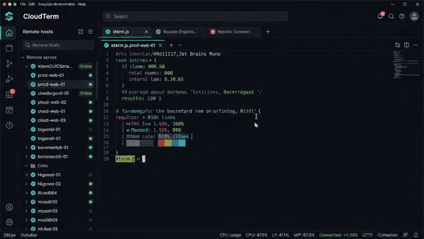

# CloudTerm

**Cliente SSH y SFTP.** Escritorio (Windows / Linux) y app nativa Android.
Terminal, gestor de archivos y tus servidores como personajes.

Sin cuenta obligatoria, sin suscripción y sin servidores intermedios: todo se
queda en tu equipo.

**Descargas → [Releases de este repo](https://github.com/pilahito/CloudTerm/releases)**

---

## Descargar e instalar

Todo sale de **una sola página**: [github.com/pilahito/CloudTerm/releases](https://github.com/pilahito/CloudTerm/releases)

| Plataforma | Archivo | Enlace |
|---|---|---|
| **Windows** | Instalador NSIS x64 | [CloudTerm_1.0.5_x64-setup.exe](https://github.com/pilahito/CloudTerm/releases/download/v1.0.5/CloudTerm_1.0.5_x64-setup.exe) |
| **Linux** | Paquete .deb | [CloudTerm_1.0.5_amd64.deb](https://github.com/pilahito/CloudTerm/releases/download/v1.0.5/CloudTerm_1.0.5_amd64.deb) |
| **Linux** | AppImage | [CloudTerm_1.0.5_amd64.AppImage](https://github.com/pilahito/CloudTerm/releases/download/v1.0.5/CloudTerm_1.0.5_amd64.AppImage) |
| **Android** | APK firmado | [CloudTerm-android-1.3.5.apk](https://github.com/pilahito/CloudTerm-Android/releases/download/v1.3.5/CloudTerm-android-1.3.5.apk) |

Código Android: [pilahito/CloudTerm-Android](https://github.com/pilahito/CloudTerm-Android). El APK se publica ahí y se enlaza desde estas Releases.

En Samsung: abre el APK → permite «orígenes desconocidos» de esta fuente si lo pide.

---

## Qué es

Una aplicación para trabajar con servidores remotos: abres una sesión, te
mueves por sus archivos y editas lo que haga falta.

El escritorio está construido sobre **Tauri 2** (Rust + React). Android es
**nativo Kotlin** (JSch + Compose), no Tauri.

| | |
|---|---|
|  |  |
| La pantalla de inicio | La terminal, con sesiones reales |

---

## Qué trae

### Terminal
Sesiones SSH de verdad. Autenticación por contraseña, clave o
keyboard-interactive (2FA/TOTP del servidor).

### Archivos
SFTP / FTP / FTPS. En escritorio, panel doble con arrastrar y soltar.

### Pixel Agents
Cada servidor es un personaje. Las transferencias se narran en el HUD.

### Paleta de comandos
`Ctrl/Cmd + K` en escritorio.

---

## Licencia

**AGPL-3.0-or-later**.

© 2026 **DavidPilahito7** · [github.com/pilahito](https://github.com/pilahito)
