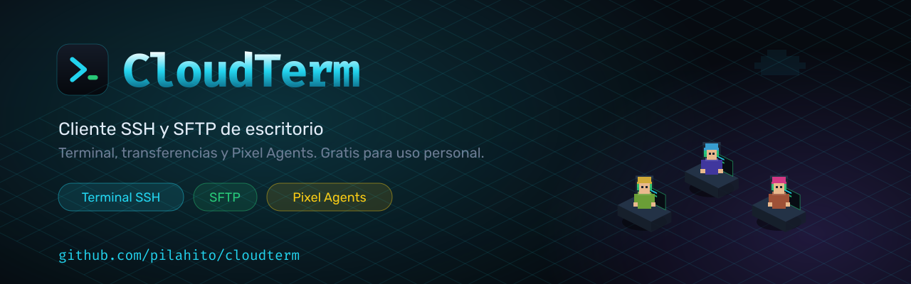
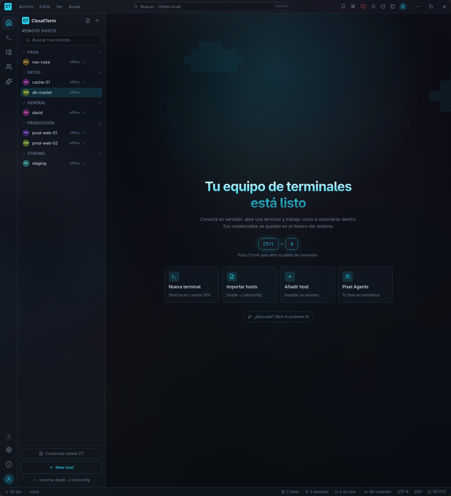
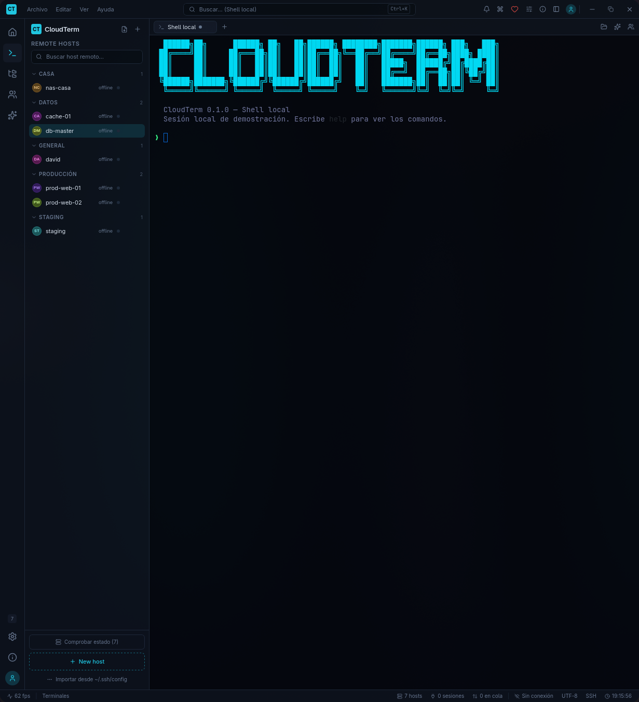

<div align="center">



# CloudTerm

**Cliente SSH y SFTP de escritorio.** Terminal, gestor de archivos de doble panel
y tus servidores como personajes.

Sin cuenta obligatoria, sin suscripción y sin servidores intermedios: todo se
queda en tu equipo.

[](LICENSE)
[](docs/IDIOMAS.md)
[](https://github.com/pilahito/cloudterm/actions/workflows/idiomas.yml)


</div>

---

## Qué es

Una aplicación de escritorio para trabajar con servidores remotos: abres una
sesión, te mueves por sus archivos y editas lo que haga falta, sin salir de la
misma ventana.

Está construida sobre **Tauri 2**, así que el núcleo es **Rust** y la interfaz
**React**. Eso significa que el SSH no lo hace un programa externo: CloudTerm
habla el protocolo directamente.

| | |
|---|---|
|  |  |
| La pantalla de inicio | La terminal, con sesiones reales |

---

## Qué trae

### Terminal
Sesiones SSH de verdad, con `xterm.js` y **russh**. Autenticación por contraseña
o por clave, con passphrase. La ventana se adapta y la sesión se redimensiona
sola. La pestaña local es un **intérprete real** (PowerShell en Windows, `$SHELL`
en Linux), no una consola de juguete.

### Archivos
Panel de **doble panel** —local a la izquierda, servidor a la derecha— con
arrastrar y soltar, cola de transferencias y barra de progreso.

**Abre un archivo remoto con tu editor**: se descarga, se abre en Visual Studio
Code (o el que uses) y **se vuelve a subir cada vez que guardas**. Sin hacer nada
más.

### Una consola dentro del gestor
Escribe `ls -la /var/log` y se ejecuta **en el servidor**. Ponle `!` delante
—`!uname -a`— y se ejecuta **en tu equipo**. Con historial, colores para la
salida de error y un símbolo distinto según dónde vaya.

### Tus servidores, ordenados
Árbol con grupos, búsqueda, estado *en línea* con latencia real y
**Pixel Agents**: cada servidor es un personaje en una escena isométrica al que
puedes pulsar para conectarte.

La escena no es decorativa: mientras un archivo se mueve, un agente lo lleva de
un escritorio al otro siguiendo el **progreso real** de la transferencia.

### Paleta de comandos
`Ctrl/Cmd + K` para llegar a cualquier acción sin soltar el teclado.

### Protegido si quieres
- **Bloqueo de la aplicación** con cuenta local —nombre y contraseña, sin cuenta
  en ningún sitio— o con Google y GitHub.
- **Segundo factor obligatorio**: un código de tu aplicación de autenticación
  (Google Authenticator, Microsoft Authenticator, Authy…), con **códigos de
  recuperación** de un solo uso.
- **Verificación de la clave del servidor** contra un `known_hosts` propio, con
  aviso si cambia.
- Las contraseñas van al **llavero del sistema**, nunca a un fichero.

→ [Cómo funciona la seguridad](docs/SEGURIDAD.md)

### Copia de seguridad donde tú digas
Tus hosts y ajustes, en el sitio que elijas:

| Destino | Para quién |
|---|---|
| **Una carpeta** | Cualquier nube con cliente de escritorio: Dropbox, OneDrive, Mega… |
| **WebDAV** | Nextcloud, ownCloud, Synology, Box o un servidor propio |
| **Mi servidor** | Tu servidor por SSH, con la misma verificación de clave |
| **GitHub** / **Google Drive** | Un gist secreto o la carpeta privada de la app |

**Las credenciales no se sincronizan nunca.** Los hosts y los ajustes sí; las
contraseñas se quedan en cada equipo.

### En tu idioma
**Español, inglés y chino simplificado**, y las traducciones están abiertas:
cualquiera puede añadir un idioma dejando un fichero JSON, sin tocar código. Si
un idioma no lo firma el autor del proyecto, la aplicación **avisa antes de
usarlo**.

→ [Cómo traducir CloudTerm](docs/IDIOMAS.md)

---

## Instalación

### Linux
```bash
git clone https://github.com/pilahito/cloudterm
cd cloudterm
./scripts/instalar.sh
```
Deja el binario en `~/.local/bin`, el lanzador en el menú de aplicaciones y los
iconos en su sitio. Se quita con `./scripts/instalar.sh --quitar`.

También hay `packaging/PKGBUILD` para Arch.

### Android

La app **nativa** (Kotlin, no Tauri) está en
[pilahito/CloudTerm-Android](https://github.com/pilahito/CloudTerm-Android):
terminal SSH, SFTP y el mismo icono. Se genera el APK en Actions → *APK de Android*.

### Windows y macOS
Los instaladores se generan en cada publicación, en la pestaña
[**Releases**](https://github.com/pilahito/cloudterm/releases).

### Desde el código
```bash
npm install
npm run tauri build        # instaladores
npm run tauri dev          # desarrollo
```

---

## Primeros pasos

La primera vez que la abras, un **tutorial de ocho pasos** te enseña la interfaz:
empieza preguntándote el idioma y luego va señalando cada parte con una flecha.
Se puede saltar, y repetir desde **Ayuda → Ver el tutorial**.

Después:

1. **Añade un servidor** con el botón `+` del árbol, o importa tu
   `~/.ssh/config` de golpe.
2. **Conéctate** pulsándolo. Si el servidor es nuevo, te enseñará su huella para
   que la compruebes.
3. **Abre la vista de archivos** en la barra lateral y arrastra lo que quieras
   mover.

---

## Cómo está hecho

```
CloudTerm
├── src/                    Interfaz (React 19 + TypeScript + Tailwind)
│   ├── components/         Shell, terminal, archivos, ajustes, tutorial…
│   ├── stores/             Estado (Zustand): conexiones, pestañas, ajustes…
│   ├── lib/                Puente con el backend
│   └── i18n/               Traducciones: es · en · zh
└── src-tauri/              Núcleo (Rust)
    └── src/
        ├── ssh/            Cliente SSH, verificación de clave, registro
        ├── pty.rs          Terminal local (PowerShell / $SHELL)
        ├── sftp/           Transferencias, editor externo, consola
        ├── db/             Hosts en SQLite
        ├── auth/           Cuentas, segundo factor y destinos de copia
        ├── ai/             Asistente (Ollama local o DeepSeek)
        └── actualizacion.rs
```

**Decisiones que conviene conocer:**

- **El SSH es propio** (`russh`), no un `ssh` externo. Por eso se puede verificar
  la clave del servidor y dar mensajes de error que se entienden.
- **Los hosts van en SQLite**, no en un fichero de texto.
- **Los secretos van al llavero del sistema**; lo que se guarda en disco son
  hashes, y con permisos `0600`.
- **La interfaz está traducida por claves**, y el español es la referencia: lo
  que falte en otro idioma cae al español.

---

## Desarrollo

```bash
npm run tauri dev            # aplicación en modo desarrollo
cargo test --manifest-path src-tauri/Cargo.toml --lib   # pruebas del núcleo
npx tsc --noEmit             # tipos de la interfaz
npm run idiomas              # comprobar las traducciones
```

Hay más de **145 pruebas** en el núcleo. Las de conexión real se saltan solas si
no hay servidor; para ejecutarlas de verdad:

```bash
./scripts/sshd-prueba.sh     # levanta un sshd de usar y tirar
cargo test --manifest-path src-tauri/Cargo.toml --lib ssh::
```

---

## Contribuir

Lo más útil ahora mismo, por orden:

1. **Traducir a tu idioma.** No hace falta saber programar: es un fichero JSON y
   un script que comprueba que no falte nada. → [IDIOMAS.md](docs/IDIOMAS.md)
2. **Reportar fallos** con el registro de conexiones adjunto
   (`~/.local/share/com.pilahito.cloudterm/conexiones.log`): ahí queda cada
   intento con su hora y cuánto tardó.
3. **Probar en macOS.** Windows ya se ha instalado en un PC; macOS no.

Antes de proponer un cambio, comprueba que pasa esto:

```bash
cargo test --manifest-path src-tauri/Cargo.toml --lib
npx tsc --noEmit
npm run idiomas
```

---

## Documentación

| Documento | Contenido |
|---|---|
| [DOCUMENTACION.md](docs/DOCUMENTACION.md) | Referencia técnica: arquitectura, datos, comandos y eventos |
| [MEJORAS.md](docs/MEJORAS.md) | Diario de construcción, con las decisiones y los errores |
| [SEGURIDAD.md](docs/SEGURIDAD.md) | Bloqueo, segundo factor y qué protege de verdad |
| [CUENTAS.md](docs/CUENTAS.md) | Inicio de sesión con Google y GitHub |
| [IDIOMAS.md](docs/IDIOMAS.md) | Cómo traducir y publicar un idioma |
| [PLATAFORMAS.md](docs/PLATAFORMAS.md) | Estado real en cada sistema, sin adornos |
| [CHANGELOG.md](CHANGELOG.md) | Qué cambió en cada versión |

---

## Lo que todavía no está

Dicho claro, para que nadie se lleve una sorpresa:

- **Android no compila.** El llavero que usa el proyecto no soporta esa
  plataforma y el proyecto Android no está generado. Es un trabajo pendiente, no
  un ajuste.
- **macOS no se ha probado** en un equipo real. Compila, pero eso no es lo
  mismo que funcionar. Windows sí se ha instalado y arrancado en un PC.
- **La copia es de hosts y ajustes**, no de credenciales.
- **Los mensajes del núcleo** están en español; los más comunes se traducen en la
  interfaz.
- **Falta** reanudar transferencias interrumpidas. Las carpetas sí se copian
  y una transferencia en curso se puede cancelar.

---

## Apoyar el proyecto

CloudTerm es libre y lo seguirá siendo. Si te resulta útil:

- ☕ [Buy Me a Coffee](https://buymeacoffee.com/pilahito)
- 💙 [PayPal](https://paypal.me/pilahito)

Y si lo usas en una empresa, escríbeme: hay licencia comercial para quien la
necesite.

---

## Licencia

**AGPL-3.0-or-later**. Puedes usarlo, estudiarlo, modificarlo y redistribuirlo;
si ofreces una versión modificada como servicio, tienes que publicar los cambios.

© 2026 **DavidPilahito7** · [github.com/pilahito](https://github.com/pilahito)
