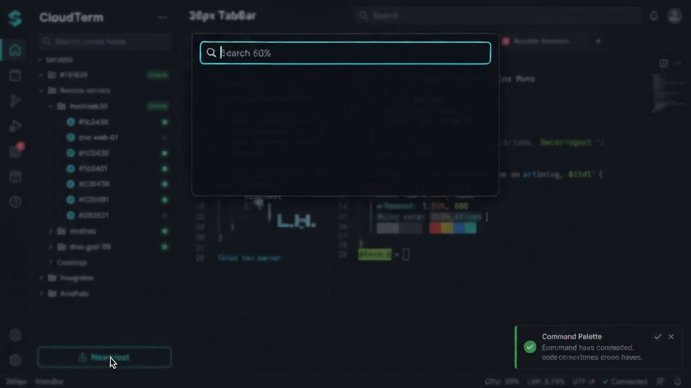
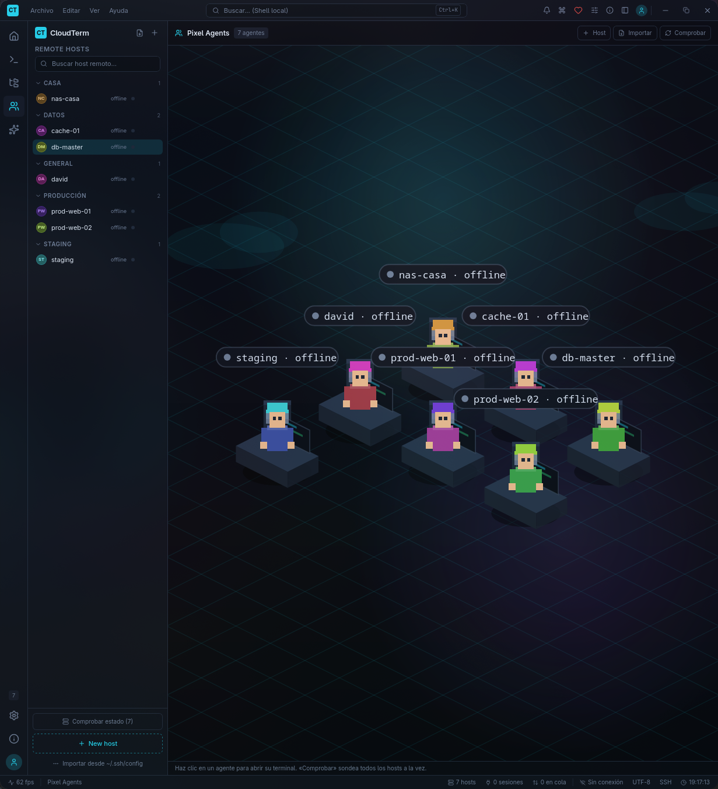

# CloudTerm

**Cliente SSH y SFTP.** Escritorio (Windows / Linux) y app nativa Android.
Terminal, gestor de archivos y tus servidores como personajes.

Sin cuenta obligatoria, sin suscripción y sin servidores intermedios: todo se
queda en tu equipo.

**Descargas → [Releases de este repo](https://github.com/pilahito/CloudTerm/releases)**

El repo anterior [AdministradorArchivos](https://github.com/pilahito/AdministradorArchivos) está desactualizado y apunta aquí.

---

## Vídeos

### Escritorio (Windows / Linux)

[Ver vídeo](https://github.com/pilahito/CloudTerm/raw/main/docs/capturas/ejemplo.mp4)
· [GIF](docs/capturas/ejemplo.gif)

### Android

Grabación de la app nativa (pantalla completa, tema mint).

Para publicarla en este repo: arrastra `docs/videos/android.mp4` desde GitHub
(Add file → Upload) — el fichero es binario y no cabe por el editor de texto.
Mientras tanto el APK y las capturas salen de
[CloudTerm-Android](https://github.com/pilahito/CloudTerm-Android).

Capturas de escritorio de referencia:

| Inicio | Terminal | Pixel Agents |
| --- | --- | --- |
|  |  |  |

---

## Descargar e instalar

Todo sale de **una sola página**: [github.com/pilahito/CloudTerm/releases](https://github.com/pilahito/CloudTerm/releases)

| Plataforma | Archivo | Enlace |
|---|---|---|
| **Windows** | Instalador NSIS x64 | [CloudTerm_1.0.5_x64-setup.exe](https://github.com/pilahito/CloudTerm/releases/download/v1.0.5/CloudTerm_1.0.5_x64-setup.exe) |
| **Linux** | Paquete .deb | [CloudTerm_1.0.5_amd64.deb](https://github.com/pilahito/CloudTerm/releases/download/v1.0.5/CloudTerm_1.0.5_amd64.deb) |
| **Linux** | AppImage | [CloudTerm_1.0.5_amd64.AppImage](https://github.com/pilahito/CloudTerm/releases/download/v1.0.5/CloudTerm_1.0.5_amd64.AppImage) |
| **Android** | APK firmado | [CloudTerm-android-1.3.5.apk](https://github.com/pilahito/CloudTerm-Android/releases/download/v1.3.5/CloudTerm-android-1.3.5.apk) |

Código Android: [pilahito/CloudTerm-Android](https://github.com/pilahito/CloudTerm-Android).

---

## Licencia

**AGPL-3.0-or-later**.

© 2026 **DavidPilahito7** · [github.com/pilahito](https://github.com/pilahito)
